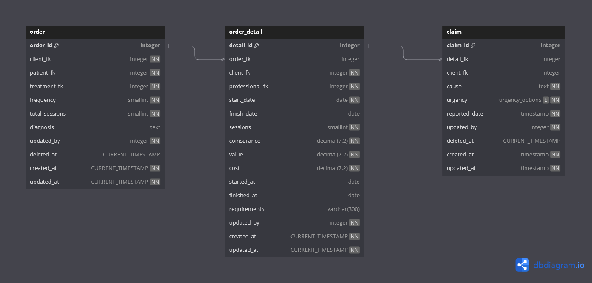

# database

## Diagrama de Entidad-Relación (DER)

# Estructura de la Base de Datos

## Tabla "order"

### Estructura
La tabla "order" tiene la siguiente estructura:

| Columna             | Tipo                | Restricciones                             |
|---------------------|---------------------|-------------------------------------------|
| `order_id`          | **PRIMARY KEY**     |                                           |
| `client_fk`         | **FOREIGN KEY**     | NOT NULL                                  |
| `patient_fk`        | **FOREIGN KEY**     | NOT NULL                                  |
| `treatment_fk`      | **FOREIGN KEY**     | NOT NULL                                  |
| `frequency`         | **SMALLINT**        | NOT NULL                                  |
| `total_sessions`    | **SMALLINT**        | NOT NULL                                  |
| `diagnosis`         | **TEXT**            |                                           |
| `requirements`      | **VARCHAR(300)**    |                                           |
| `updated_by`        | **FOREIGN KEY**     |                                           |
| `deleted_at`        | **TIMESTAMP**       |                                           |
| `created_at`        | **TIMESTAMP**       | NOT NULL DEFAULT CURRENT_TIMESTAMP        |
| `updated_at`        | **TIMESTAMP**       | NOT NULL DEFAULT CURRENT_TIMESTAMP        |

### Descripción
[COMPLETAR_DESCRIPCION]

***

## Tabla "order_detail"

### Estructura
La tabla "order" tiene la siguiente estructura:

| Columna             | Tipo                | Restricciones                             |
|---------------------|---------------------|-------------------------------------------|
| `detail_id`         | **PRIMARY KEY**     |                                           |
| `order_fk`          | **FOREIGN KEY**     | REFERENCES "order"(order_id)              |
| `client_fk`         | **FOREIGN KEY**     | NOT NULL                                  |
| `professional_fk`   | **FOREIGN KEY**     |                                           |
| `start_date`        | **TIMESTAMP**       | NOT NULL                                  |
| `finish_date`       | **TIMESTAMP**       | NOT NULL                                  |
| `sessions`          | **SMALLINT**        | NOT NULL                                  |
| `coinsurance`       | **DECIMAL(7,2)**    | NOT NULL DEFAULT 0                        |
| `value`             | **DECIMAL(7,2)**    | NOT NULL                                  |
| `cost`              | **DECIMAL(7,2)**    | NOT NULL                                  |
| `requirements`      | **VARCHAR(300)**    |                                           |
| `updated_by`        | **FOREIGN KEY**     |                                           |
| `created_at`        | **TIMESTAMP**       | NOT NULL DEFAULT CURRENT_TIMESTAMP        |
| `updated_at`        | **TIMESTAMP**       | NOT NULL DEFAULT CURRENT_TIMESTAMP        |

### Descripción
[COMPLETAR_DESCRIPCION]

***

## Tabla "claim"

### Estructura
La tabla "claim" tiene la siguiente estructura:

| Columna         | Tipo                | Restricciones                                   |
|-----------------|---------------------|-------------------------------------------------|
| `claim_id`      | **PRIMARY KEY**     |                                                 |
| `detail_fk`     | **FOREIGN KEY**     | NOT NULL REFERENCES "order_detail"(detail_id)   |
| `client_fk`     | **FOREIGN KEY**     | NOT NULL                                        |
| `cause`         | **TEXT**            | NOT NULL                                        |
| `urgency`       | **urgency_options** | NOT NULL                                        |
| `reported_date` | **TIMESTAMP**       | NOT NULL                                        |
| `updated_by`    | **FOREIGN KEY**     |                                                 |
| `deleted_at`    | **TIMESTAMP**       |                                                 |
| `created_at`    | **TIMESTAMP**       | NOT NULL DEFAULT CURRENT_TIMESTAMP              |
| `updated_at`    | **TIMESTAMP**       | NOT NULL DEFAULT CURRENT_TIMESTAMP              |

### Descripción
[COMPLETAR_DESCRIPCION]